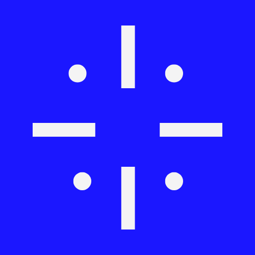

  

<h1 align="center">Delynor</h1>

Ürün odaklı, yalın ve ölçeklenebilir dijital deneyimler üreten bağımsız teknoloji ekibi.

---

## About Us
Delynor, yazılım üretimini bir zanaat olarak gören üç kurucu tarafından oluşturulmuş küçük fakat yüksek odaklı bir teknoloji ekibidir. Amacımız; gereksiz karmaşıklıktan uzak, sürdürülebilir, kullanıcı odaklı ve uzun vadeli değer üreten dijital ürünler geliştirmektir.

Ekip olarak tasarım, yazılım ve ürün stratejisini tek bir bütün hâline getiriyor; yalnızca çalışan değil, aynı zamanda anlam yaratan ve ölçeklenebilir dijital deneyimler inşa etmeye odaklanıyoruz.

Delynor, hızlı büyüme kaygısı yerine doğru ürünü doğru biçimde üretmeyi öncelik haline getiren, kaliteyi ve şeffaf üretim süreçlerini merkezine alan bir ekip kültürüne sahiptir.

---

## What We Do

### Ürün ve Yazılım Geliştirme
- SaaS platformları için uçtan uca geliştirme  
- Modern ve yüksek performanslı web uygulamaları  
- Modüler ve bulut tabanlı backend mimarileri  
- Next.js, NestJS, React Native gibi güncel teknolojilerle hızlı ve optimize frontend geliştirme  

### Tasarım ve Kullanıcı Deneyimi
- Ürün keşfi, kullanıcı ihtiyaç analizi ve problem doğrulama  
- Akış, bilgi mimarisi ve wireframe tasarımı  
- Minimal, işlevsel ve marka uyumlu UI sistemleri  
- Web ve mobil odaklı kullanıcı deneyimi tasarımı  

### Strateji, Yönlendirme ve Danışmanlık
- Ürünleşme süreci planlama ve MVP geliştirme  
- Teknoloji seçimi, mimari danışmanlık ve ölçeklenme stratejisi  
- Kurumsal ve bireysel projeler için teknik danışmanlık  
- Ürünün fikir aşamasından büyüme aşamasına kadar düzenli teknik rehberlik  

---

## Our Approach
- Gereksiz özelliklerden uzak, yalnızca gerçek fayda sağlayan fonksiyonlara odaklanırız.  
- Kod kalitesini, sürdürülebilirliği ve uzun vadeli gelişebilirliği ön planda tutarız.  
- Tasarım ve teknolojiyi aynı üretim disiplininde birleştiririz.  
- Ürünün kullanıcıyla kurduğu ilişkiye büyük önem verir, yalın ve anlaşılır deneyimler tasarlarız.  
- Şeffaf iş akışları ve düzenli geri bildirim döngüleri ile çalışırız.  

---

## Active Project: Madeinyouu
Şu anda Delynor ekibi olarak aktif şekilde **Madeinyouu** adında yeni bir dijital ürün geliştiriyoruz.

Madeinyouu; içerik üreticilerini, dijital ürün sahiplerini ve yaratıcı profesyonelleri destekleyen, üretim süreçlerini kolaylaştıran ve merkezi bir deneyim sunan bir platform olarak tasarlanıyor.

Bu proje, Delynor'un ürün odaklı yaklaşımının doğrudan bir yansıması olup; sade tasarım, güçlü altyapı ve ölçeklenebilir bir mimari üzerine kurulmaktadır.

Projenin geliştirme süreci ilerledikçe detaylar duyurulacaktır.

---

## Team
- [Talha Tarlabaz](https://www.talhatarlabaz.com)  
- [Poyraz Avsever](https://www.poyrazavsever.com)  
- [Halitcan Emir](https://www.halitcanemir.com)

---

## Contact
Her türlü iş birliği, proje veya danışmanlık talepleri için:  
**delynorteam@gmail.com**

---

## Projects
Yakında yeni projeler yayınlanacaktır.
